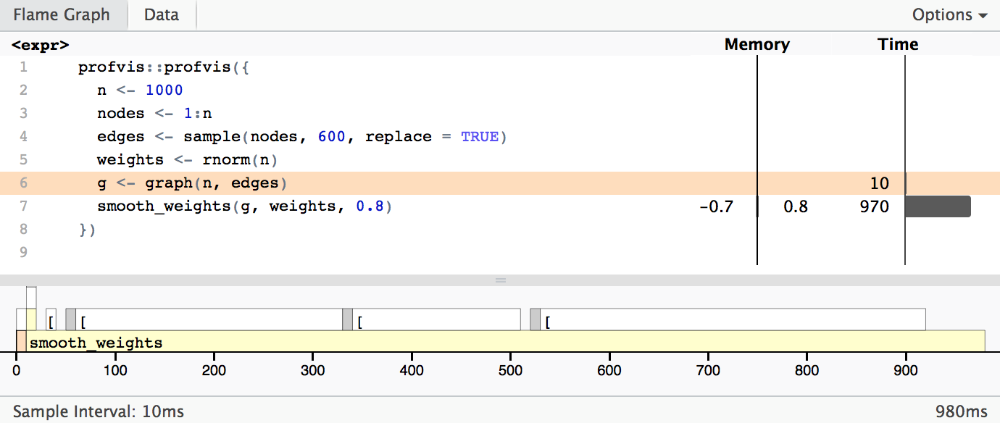

What to do when you find that your code is running too slow, and, in particular, how to figure out why it is running too slow.  
It is important to consider if it is worth speeding it up. It takes you time to improve performance, it is only worth it if the improved performance saves you time when this extra programming is included. Any code you just need to run a few times during an analysis is usually not worth optimizing.  
If you are developing a package, though, you often do have to consider performance to some extent. If you find that your code is slow, you shouldn’t be guessing at where it is slow. You should measure the running time and get to know for sure = profiling.  

## profvis package
Profiling will be performed on a graph algorithm that aims to smooth weights on nodes that are directly connected.  
Graph representation: *incidence matrix* (0 = not connected, 1 = connected)  
Graph is non-directed
```{r}
graph <- function(n, edges) { #n = number of nodes
  m <- matrix(0, nrow = n, ncol = n)

  no_edges <- length(edges)
  if (no_edges >= 1) {
    for (i in seq(1, no_edges, by = 2)) {
      m[edges[i], edges[i+1]] <- m[edges[i+1], edges[i]] <- 1
    }
  }

  structure(m, class = "graph")
}
```
Even though the graph representation is just a matrix, I give it a class in case I want to write generic functions for it later.  
The smoothing function:
```{r}
smooth_weights <- function(graph, node_weights, alpha) {
  if (length(node_weights) != nrow(graph))
    stop("Incorrect number of nodes")

  no_nodes <- length(node_weights)
  new_weights <- vector("numeric", no_nodes)

  for (i in 1:no_nodes) {
    neighbour_weights <- 0
    n <- 0
    for (j in 1:no_nodes) {
      if (i != j && graph[i, j] == 1) {
        neighbour_weights <- neighbour_weights + node_weights[j]
        n <- n + 1
      }
    }

    if (n > 0) {
      new_weights[i] <-
        alpha * node_weights[i] +
        (1 - alpha) * neighbour_weights / n
    } else {
      new_weights[i] <- node_weights[i]
    }

  }
  new_weights
}
```
To profile this code, we use the profvis() function from profvis package. It takes an expression as its single argument so to profile more than a single function call we give it a code block, translating the sequence of statements into an expression.
```{r}
# install.packages("profvis")
profvis::profvis({
  n <- 1000
  nodes <- 1:n
  edges <- sample(nodes, 600, replace = TRUE)
  weights <- rnorm(n)
  g <- graph(n, edges)
  smooth_weights(g, weights, 0.8)
})
```

Running this code will open a new tab showing the results. The top half of the tab shows your code with annotations showing memory usage first and time usage second as horizontal bars. The bottom half of the window shows the time usage plus callstack.
Total execution took cca 980 ms. The time spent in individual functions is shown at the bottom of the graph.  
From the results, we can see that most time was spent in smooth_weights function. Now if we had a performance problem with this code, this is where we should concentrate our optimization efforts. The very first run of the code is shown in the following picture.



## Second solution
**If you need to optimize something, the first you should be thinking is—is there a better algorithm or a better data structure? Algorithmic improvements are much more likely to give substantial performance improvements compared to just changing details of an implementation.**  
In this case, if the graphs we are working on are sparse, meaning they have few actual edges compared to all possible edges, then an incidence matrix is not a good representation. We could speed the code up by using vector expressions to replace the inner loop and hacks like that, but we are much better off considering another representation of the graph. Instead of a matrix, we will represent the edges as a list where, for each node, we have a vector of that node’s neighbors.
```{r}
graph <- function(n, edges) {
  neighbours <- vector("list", length = n)

  for (i in seq_along(neighbours)) {
    neighbours[[i]] <- vector("integer", length = 0)
  }

  no_edges <- length(edges)
  if (no_edges >= 1) {
    for (i in seq(1, no_edges, by = 2)) {
      n1 <- edges[i]
      n2 <- edges[i+1]
      neighbours[[n1]] <- c(n2, neighbours[[n1]])
      neighbours[[n2]] <- c(n1, neighbours[[n2]])
    }
  }

  for (i in seq_along(neighbours)) {
    neighbours[[i]] <- unique(neighbours[[i]])
  }

  structure(neighbours, class = "graph")
}
```
And updated graph function:
```{r}
smooth_weights <- function(graph, node_weights, alpha) {
  if (length(node_weights) != length(graph))
    stop("Incorrect number of nodes")

  no_nodes <- length(node_weights)
  new_weights <- vector("numeric", no_nodes)

  for (i in 1:no_nodes) {
    neighbour_weights <- 0
    n <- 0
    for (j in graph[[i]]) {
      if (i != j) {
        neighbour_weights <- neighbour_weights + node_weights[j]
        n <- n + 1
      }
    }

    if (n > 0) {
      new_weights[i] <-
        alpha * node_weights[i] +
        (1 - alpha) * neighbour_weights / n
    } else {
      new_weights[i] <- node_weights[i]
    }

  }
  new_weights
}
```
Profiling code is the same:
```{r}
profvis::profvis({
  n <- 1000
  nodes <- 1:n
  edges <- sample(nodes, 600, replace = TRUE)
  weights <- rnorm(n)
  g <- graph(n, edges)
  smooth_weights(g, weights, 0.8)
})
```
We see that we got a substantial performance improvement. The execution time is now 20 ms instead of 1800 ms. The profiler doesn’t have an infinite resolution, it samples every 10 ms as it says at the bottom left, so in fact, it has only sampled twice in this run. To see more detailes, let's add some nodes and edges:
```{r}
profvis::profvis({
  n <- 30000
  nodes <- 1:n
  edges <- sample(nodes, 5000, replace = TRUE)
  weights <- rnorm(n)
  g <- graph(n, edges)
  smooth_weights(g, weights, 0.8)
})
```
To our surprise, we see that for the larger graph we are actually spending more time constructing the graph than smoothing it.  
If you are in that situation where there is nothing more obvious to try to speed up, you have to consider if any more optimization is really necessary. Unless you can come up with a better algorithm, which is hard, further optimizations are going to be very hard and unlikely to be worth the effort. There are some last resorts you can go to such as parallelizing your code or moving time-critical parts of it to C++.  
And before you do anything make sure you have unit tests that ensure that new implementations do not break old functionality! Your new code can be as fast as lightning, and it is worthless if it isn’t correct.

## Fine tuning with microbenchmark
If miliseconds is not a fine enough measure, try finer profiling with microbenchmark.
```{r}
#install.packages("microbenchmark")
library(microbenchmark)
mysum <- function(sequence) {
  s <- 0
  for (x in sequence) s <- s + x
  s
}

microbenchmark(
  sum(1:10),
  mysum(1:10)
)
```

The first column in the output is the expressions evaluated, then you have the minimum, lower quarter, mean, median, upper quarter, and maximum time observed when evaluating it, and then the number of evaluations used. The last column ranks the performance, here showing that sum() is a and mysum() is b so the first is faster. This ranking takes the variation in evaluation time into account and does not just rank by the mean.

### Rule of thumbs
There are a few rules of thumbs for speeding up the code in micro-optimization, but you should always measure. Intuition is often a quite bad substitute for measurement.  
One rule of thumb is to use built-in functions when you can. Functions such as sum() are actually implemented in C and highly optimized, so your own implementation will have a hard time competing with it, as you saw previously.  
Another rule of thumb is to use the simplest functions that get the work done. More general functions introduce various overheads that simpler functions avoid. You can add together all numbers in a sequence using Reduce(), but using such a general function is going to be relatively slow compared to specialized functions.
```{r}
microbenchmark(
  sum(1:10),
  mysum(1:10),
  Reduce(`+`,1:10,0)
)
```
We use such general functions for programming convenience. They give us abstract building blocks. We rarely get performance boosts out of them and sometimes they can slow things down.  
Thirdly, do as little as you can get away with. Many functions in R have more functionality than we necessarily think about. A function such as read.table() not only reads in data, it also figures out what type each column should have. If you tell it what the types of each column are using the colClasses argument, it gets much faster because it doesn’t have to figure it out itself. For factor() you can give it the allowed categories using the levels argument so it doesn’t have to work it out itself.
```{r}
x <- sample(LETTERS, 1000, replace = TRUE)
microbenchmark(
  factor(x, levels = LETTERS),
  factor(x)
)
```

Fourthly, when you can, use vector expressions instead of loops.  
Most importantly, though, is to always measure when you try to improve performance and only replace simple code with more complex code if there is a substantial improvement that makes this worthwhile.
